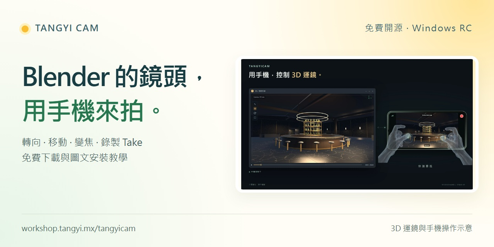
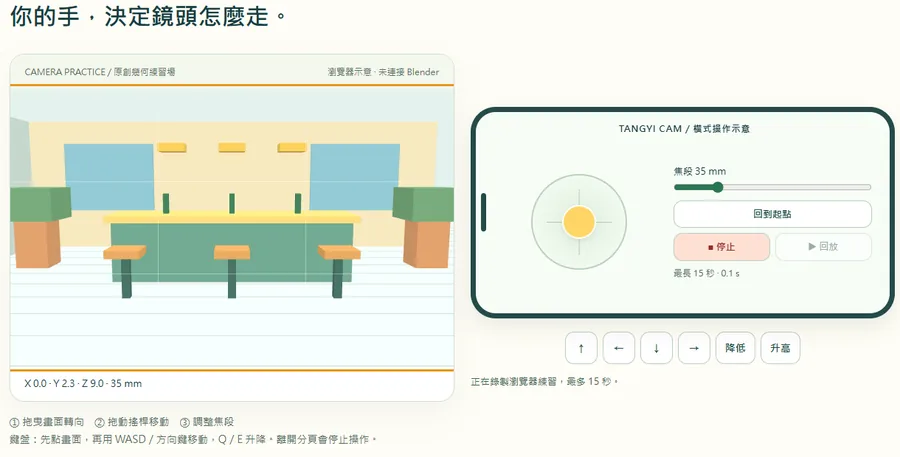

# Tangyi Cam — Phone Virtual Camera for Blender

[](https://github.com/tangyistudio/tangyicam/actions/workflows/ci.yml)
[](LICENSE)
[](https://github.com/tangyistudio/tangyicam/releases/tag/v0.4.0-rc.1)

### [▶ Live Demo — try the camera in your browser](https://tangyistudio.github.io/tangyicam/)

[繁體中文](README.zh-TW.md) · [Demo](https://tangyistudio.github.io/tangyicam/) · [Q&A](docs/FAQ.md) · [QA & test scope](docs/QA.md) · [Download](https://workshop.tangyi.mx/tangyicam)

**用手機控制 Blender 攝影機，將運鏡錄成可編輯的 Take。**
A local-first phone camera controller for Blender, with gyro rotation, joystick movement, shot lists, recording and preview export.

[免費下載 / 安裝教學](https://workshop.tangyi.mx/tangyicam) · [作品示範](https://workshop.tangyi.mx/resources) · [Release notes](docs/CHANGELOG.md)

> **0.4.0 release candidate.** Windows x64 / Blender 4.5.10 and 5.1.2 installation, recording and export have been tested. iPhone Safari hardware acceptance is still pending. This is not a stable-release claim.

[](https://workshop.tangyi.mx/tangyicam)

**[Watch the 30-second camera-control demo](https://media.tangyi.mx/opensource/20260924/tangyicam-secondhand-30s.mp4)** · [Product story / 作品發表](https://tangyi.mx/blog/tangyicam-phone-controlled-blender-camera)

The demo uses SECONDHAND 3D scenes, simplified software UI and simulated phone operation. It is not an iPhone hardware recording; film assets are not included in the download.

## Blender 手機運鏡外掛 / Virtual camera workflow

Tangyi Cam is a free, open-source **Blender add-on for phone-controlled virtual cinematography and previs**. Use a mobile browser to rotate the camera, move with on-screen joysticks, adjust focal length and save editable camera takes. Camera control runs locally on your private Wi-Fi.

用手機掌握 3D 場景裡的角度、移動與焦段，錄下運鏡後回到 Blender 編輯關鍵影格。適合鏡頭預演與拍攝路線練習；不需要 LLM，也不會自動生成 3D 場景。

## Try it before installing

[](https://tangyistudio.github.io/tangyicam/)


The [interactive demo](https://tangyistudio.github.io/tangyicam/) has an original geometric practice scene. Drag the view to look around, use the joystick or WASD to move, change focal length, and record/replay up to 15 seconds of camera movement. On touchscreens, drag the canvas and joystick. Keyboard controls work after focusing the practice area.

**This demo runs entirely in the browser.** It does not connect to Blender, request phone sensor access, install certificates, export MP4 or measure add-on latency. Practice takes live in memory and disappear on reload. It is a way to understand the controls, not evidence of iPhone hardware acceptance.

| | Browser demo | Installed Blender add-on |
|---|---|---|
| Scene | Included procedural geometry | Your own Blender scene |
| Orientation | Drag with mouse / touch | Phone DeviceOrientation |
| Position | Joystick / keys | Phone joysticks / camera modes |
| Takes | Up to 15 seconds, in-memory replay | Independent camera takes and editable keyframes |
| Export | No MP4 export | Preview MP4 + first / last PNG |
| Setup | Open the page | Install ZIP, private Wi-Fi, local HTTPS and pairing |

See the [demo source](docs/demo/), [Q&A and troubleshooting](docs/FAQ.md), and [what the tests actually cover](docs/QA.md).

## What it does

- Phone browser controls camera orientation through DeviceOrientation and position through joysticks / dolly mode.
- Local HTTPS, one-time six-digit pairing, HttpOnly sessions and disconnect / focus-loss stop handling.
- Live scene preview, adjustable smoothing, horizon lock, focal length and shot-list camera poses.
- Record independent camera takes and editable keyframes, then export preview MP4 plus first / last frames.
- No Workshop account, LLM, cloud generation credits or native phone app required for camera control.

**Not physical 6DOF tracking:** walking with the phone does not reconstruct its position. iPhone first-use certificate setup is required. Preview performance depends on your scene and hardware. Studio modeling / contact / animation utilities are experimental, and are not an automatic AI film generator.

## Install

1. Download `tangyicam-0.4.0-windows-x64.zip` from Releases. Keep it zipped.
2. Blender → Edit → Preferences → Get Extensions → Install from Disk. Enable TangyiCam.
3. Open a copy of your scene. In the 3D View press **N → TangyiCam → 首次設定／更新憑證**.
4. Start the phone camera server. Keep both devices on the same private Wi-Fi; allow only the private-network firewall prompt.
5. Follow the first QR to install and trust the local certificate on iPhone, comparing its SHA-256 fingerprint first.
6. Open the second QR in Safari, enter the one-time code, allow motion sensors, turn the phone landscape and recenter.

[繁體中文完整安裝與排錯](docs/RELEASE_README.md) · [Privacy](docs/PRIVACY.md) · [Device acceptance checklist](docs/TESTING.md)

Recording is camera motion, not live microphone audio. An export creates a new folder beside the blend file (`tc_export`), or in `Documents/TangyiCam/Exports` for an unsaved scene. The download does not include SECONDHAND film scenes or assets.

## FAQ / 常見問題

**Does it need a phone app or a paid account? / 要安裝手機 App 或付費嗎？**
No native phone app, Workshop account or cloud credits are required. The Blender add-on is free under GPL-3.0-or-later. First use requires the documented local HTTPS certificate setup.

**Does walking with the phone move the camera? / 手機走動能追蹤位置嗎？**
No. DeviceOrientation controls rotation; joysticks control translation. This is not physical 6DOF tracking. Scene complexity, hardware and network affect preview performance.

**What does recording export? / 可輸出什麼？**
Editable camera takes, preview MP4, `first.png` and `last.png`. Camera motion is recorded; phone microphone audio is not.

**Which platforms are verified? / 哪些環境已驗證？**
Windows x64 with Blender 4.5.10 LTS and 5.1.2 installation, recording and export have been tested. iPhone Safari hardware acceptance remains pending. Android, macOS and Linux are not verified release targets.

### Something is not working?

| Symptom | First check |
|---|---|
| Phone cannot open controller | Same private Wi-Fi, server running, correct LAN IP; guest networks may isolate devices |
| Pairing rejected | Fresh one-time code, expiry, and whether it was already used |
| Gyro does not move | HTTPS, motion permission, landscape and recenter; hardware acceptance is still pending |
| Preview is slow | Scene complexity, preview quality, computer load and Wi-Fi; the web demo is not a Blender benchmark |
| Cannot find output | `tc_export` beside the blend file, or `Documents/TangyiCam/Exports` for an unsaved scene |

[Full troubleshooting table](docs/FAQ.md#排錯--troubleshooting) · [File a reproducible bug report](https://github.com/tangyistudio/tangyicam/issues/new/choose)

## Develop and verify

Python 3.10+:

```sh
python -m unittest discover -s tests -p test_security.py
python tools/build.py
```

The build is deterministic and does not install anything unless `--install` is explicitly passed. Artifacts go to `dist/releases/0.4.0/`. On the release source snapshot, the Windows installation archive SHA-256 is:

`d7fbf3658294d37ead532a80085512b134581545c2e46dbfd89f2663e6cff20c`

Run the Blender acceptance scripts with isolated user directories as described in `tests/run_blender_acceptance.py`. Do not point automation at your everyday Blender profile. Real phone sensor permissions, LAN connectivity and long recording sessions require hardware testing; browser automation is not a substitute.

## Demo and documentation checks

Node.js 22+, Python 3.10+ and Chrome:

```sh
node --test test/demo-camera.test.mjs
python tools/check_docs.py
node tools/qa-demo.mjs
```

CI runs browser interaction checks on Linux Chrome and the existing security integration tests on Windows Python 3.11 / 3.13. **Linux CI coverage is for the demo, not a claim that the add-on supports Linux.** Browser checks cover desktop/touch controls, focal length, record/replay, input cancellation, focus-loss stopping, Q&A and layout. Read [QA.md](docs/QA.md) for the boundary between these tests and actual Blender/iPhone acceptance.

## Documentation

| Guide | What it covers |
|---|---|
| [繁體中文 README](README.zh-TW.md) | Chinese project overview and quick start |
| [Installation](docs/RELEASE_README.md) | Full local setup and certificate instructions |
| [Q&A / FAQ](docs/FAQ.md) | Common questions, limits and troubleshooting |
| [QA](docs/QA.md) | Reproducible automated checks and their scope |
| [Hardware acceptance](docs/TESTING.md) | Actual Blender package / iPhone checklist |
| [Privacy](docs/PRIVACY.md) | Local transport and data handling |
| [Changelog](docs/CHANGELOG.md) | Version history |
| [Contributing](CONTRIBUTING.md) / [Security](SECURITY.md) | Feedback and safe reports |

## License and attribution

GPL-3.0-or-later. See [LICENSE](LICENSE) and [third-party notices](tangyicam/THIRD_PARTY_NOTICES.md). The phone-camera design references the GPL Higgsfield for Blender phonecam module; Tangyi Cam adds its own local transport, pairing, recording and workflow tools. It is an independent project, not endorsed by Higgsfield or Blender. No proprietary Higgsfield model is included.

Bundled components retain their own notices: mkcert, QRCode.js, three.js formula attribution and Pillow wheels. No certificates, private keys, user film assets or model weights belong in this repository.

The original procedural browser demo is included under GPL-3.0-or-later. Product images and the externally hosted SECONDHAND demo video are promotional media © Tangyi Studio, excluded from the software license grant; see [media notices](docs/MEDIA.md).

## Feedback

Please include the Tangyi Cam version, Blender / Windows / phone OS versions, steps to reproduce and an error log. Never share pairing codes, private certificates or private scene files. Start with a small scene you are allowed to share.
